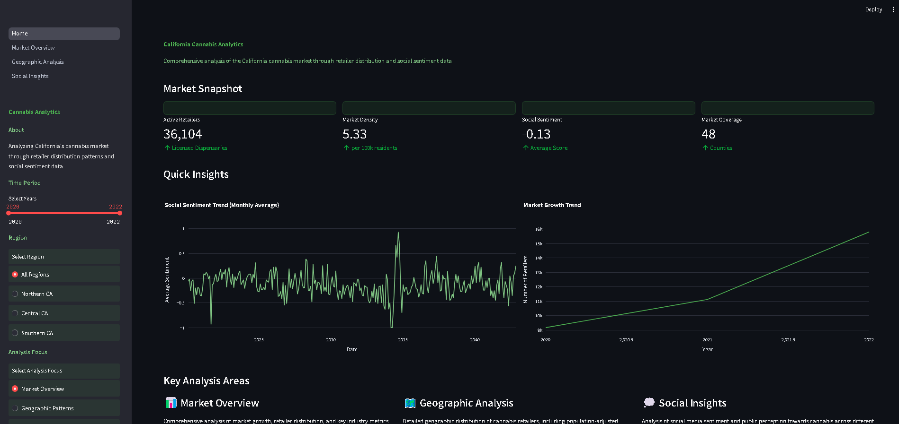

# California Cannabis Market Analytics Dashboard



## Overview

This Streamlit-based dashboard provides comprehensive analytics and insights into California's cannabis retail market. The application combines dispensary data with social media sentiment analysis to offer a multi-faceted view of the market landscape.

## Features

### 🏠 Home Dashboard
- Key market metrics and trends
- Overall market health indicators
- Quick navigation to detailed analysis sections

### 📊 Market Overview
- Year-over-year market growth analysis
- Regional distribution of dispensaries
- License type breakdown by county
- Interactive filters for custom analysis

### 🗺️ Geographic Analysis
- Interactive choropleth map of California counties
- Population-adjusted retailer density metrics
- Regional market concentration analysis
- County-level license distribution

### 💭 Social Insights
- Social media sentiment analysis by region
- Temporal sentiment trends
- Correlation between market density and public sentiment
- County-level sentiment distribution

## Data Sources

The dashboard utilizes three main data sources:
- `Dispensaries.csv`: Contains detailed information about cannabis retailers
- `Tweet_Sentiment.csv`: Social media sentiment data related to cannabis
- `California_County_Boundaries.geojson`: Geographic boundaries for visualization

## Technology Stack

- **Python**: >= 3.10
- **Key Dependencies**:
  - Streamlit: Web application framework
  - Pandas: Data manipulation and analysis
  - Plotly: Interactive visualizations
  - Transformers: Sentiment analysis models

## Setup and Installation

1. Clone the repository:
```bash
git clone https://github.com/your-username/california-cannabis-analytics.git
cd california-cannabis-analytics
```

2. Create and activate a virtual environment:
```bash
python -m venv .venv
source .venv/bin/activate  # On Windows: .venv\Scripts\activate
```

3. Install dependencies using Poetry:
```bash
poetry install
```

4. Set up environment variables:
```bash
cp .env.example .env
# Edit .env with your configuration
```

5. Run the application:
```bash
streamlit run app/Home.py
```

## Project Structure

```
├── app/
│   ├── Home.py              # Main dashboard entry point
│   ├── pages/               # Dashboard pages
│   ├── plots/               # Visualization components
│   ├── utils/               # Utility functions
│   └── style.css           # Custom styling
├── data/                    # Data files
├── config/                  # Configuration files
└── public/                  # Static assets
```

## Development

The project uses Poetry for dependency management and includes development tools:
- Black: Code formatting
- isort: Import sorting
- flake8: Code linting
- pytest: Testing

Run tests:
```bash
poetry run pytest
```

Format code:
```bash
poetry run black .
poetry run isort .
```

## Contributing

1. Fork the repository
2. Create a feature branch
3. Commit your changes
4. Push to the branch
5. Create a Pull Request
